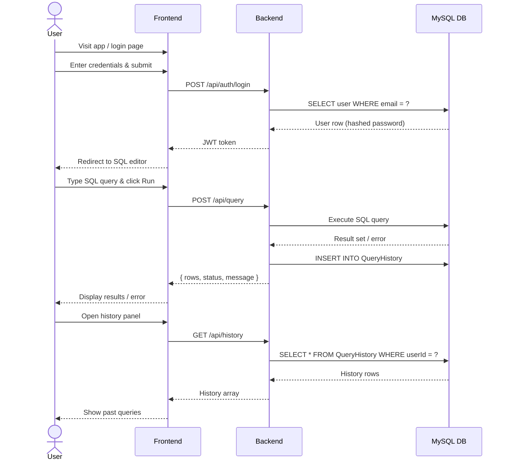
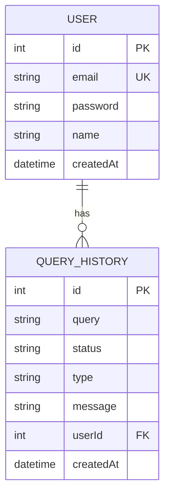

# SQL Query Runner Project

I am trying to build a SQL Query Runner with an aim to introduce more coding platforms shortly

---

## Sequence Diagram

```mermaid
sequenceDiagram
    actor User
    participant Frontend
    participant Backend
    participant MySQL as MySQL DB

    User->>Frontend: Visit app / login page

    %% Auth flow
    User->>Frontend: Enter credentials & submit
    Frontend->>Backend: POST /api/auth/login
    Backend->>MySQL: SELECT user WHERE email = ?
    MySQL-->>Backend: User row (hashed password)
    Backend-->>Frontend: JWT token
    Frontend-->>User: Redirect to SQL editor

    %% Query execution flow
    User->>Frontend: Type SQL query & click Run
    Frontend->>Backend: POST /api/query
    Backend->>MySQL: Execute SQL query
    MySQL-->>Backend: Result set / error
    Backend->>MySQL: INSERT INTO QueryHistory
    Backend-->>Frontend: { rows, status, message }
    Frontend-->>User: Display results / error

    %% History flow
    User->>Frontend: Open history panel
    Frontend->>Backend: GET /api/history
    Backend->>MySQL: SELECT * FROM QueryHistory WHERE userId = ?
    MySQL-->>Backend: History rows
    Backend-->>Frontend: History array
    Frontend-->>User: Show past queries
```

---

## ER Diagram

```mermaid
erDiagram
    USER {
        int     id          PK
        string  email       UK
        string  password
        string  name
        datetime createdAt
    }

    QUERY_HISTORY {
        int     id          PK
        string  query
        string  status
        string  type
        string  message
        int     userId      FK
        datetime createdAt
    }

    USER ||--o{ QUERY_HISTORY : "has"
```
